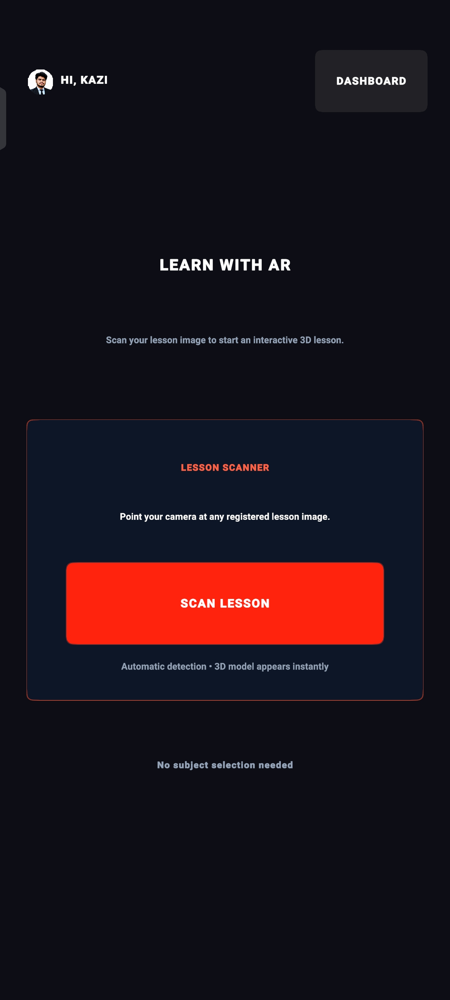
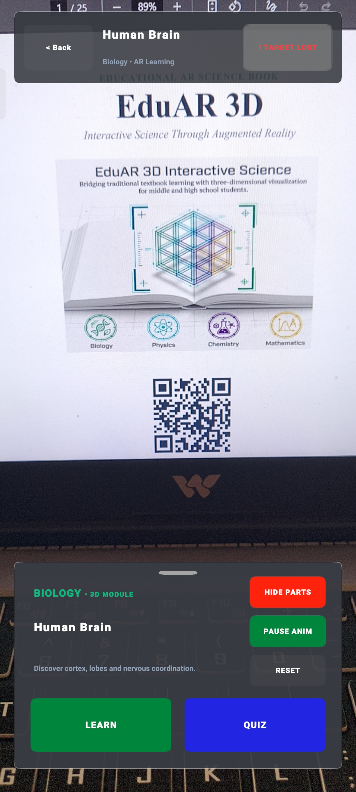
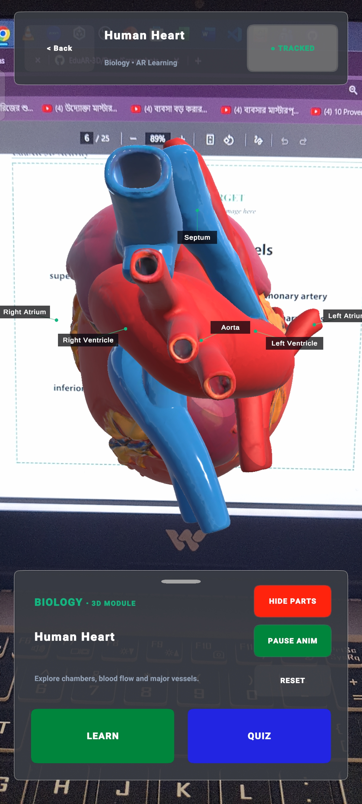
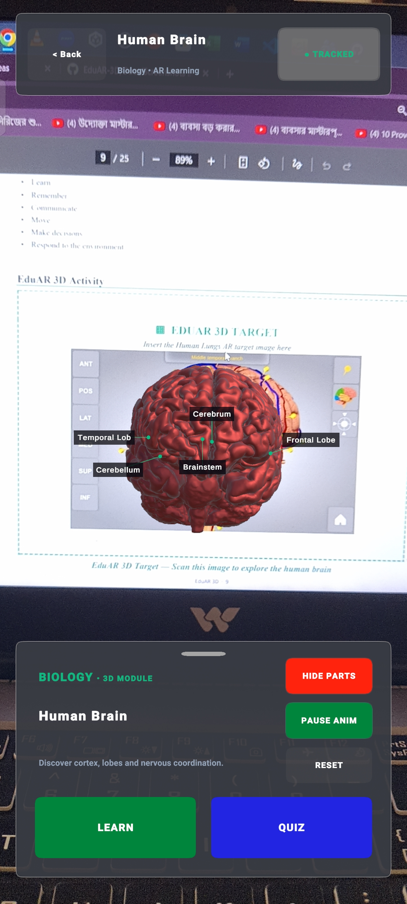
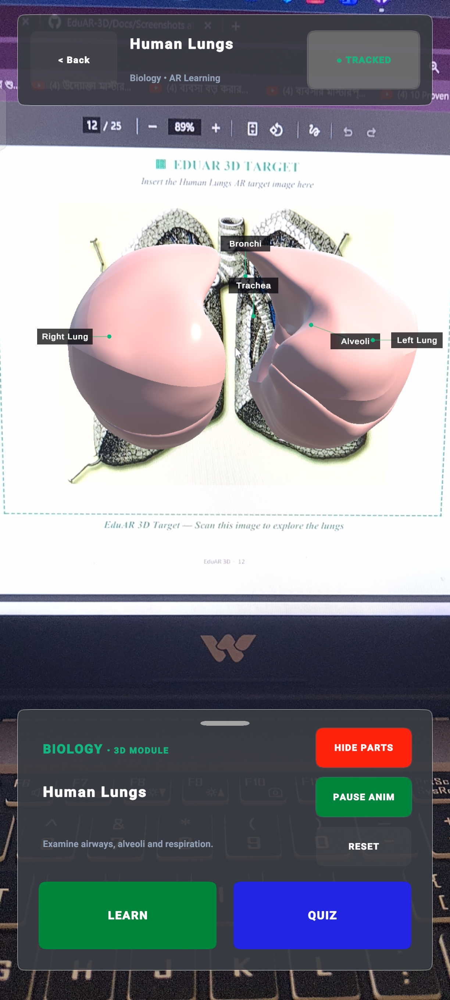
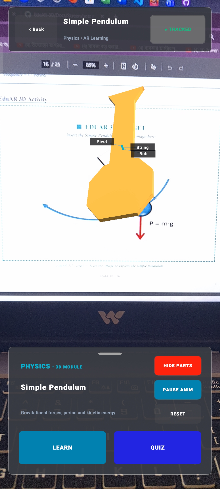
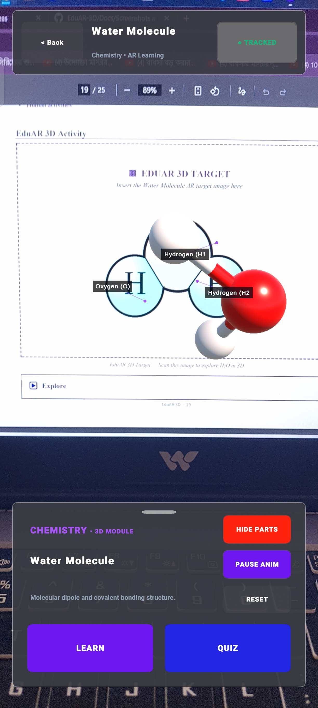
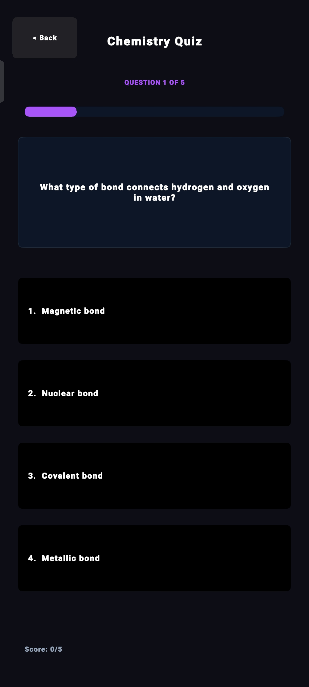
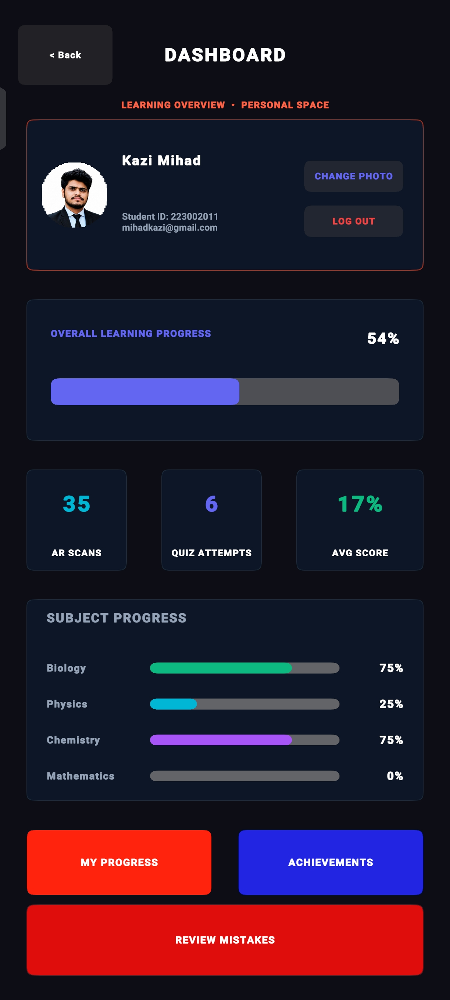

# EduAR 3D 📱🥽

<p align="center">
  <strong>Interactive Augmented Reality Learning Application</strong>
</p>

<p align="center">
  An educational mobile AR application built with <strong>Unity</strong>, <strong>C#</strong>, and <strong>Vuforia Engine</strong>.
</p>

<p align="center">
  <a href="https://github.com/mihadkazi1/EduAR-3D/releases/latest">
    
  </a>
  <a href="https://github.com/mihadkazi1/EduAR-3D/releases/tag/v1.0.0">
    
  </a>
</p>

---

## 📖 About the Project

**EduAR 3D** is an educational mobile **Augmented Reality (AR)** application developed with **Unity, C#, and Vuforia Engine**.

It combines traditional textbook-based learning with interactive 3D visualization. Students can scan registered lesson images using an Android device and automatically explore the corresponding educational 3D model.

The application provides a complete learning flow:

**Scan → Discover → Interact → Learn → Quiz → Track Progress**

---

## 🚀 Project Highlights

- 🔍 Universal lesson scanner
- 📱 Android mobile application
- 🥽 Image-based Augmented Reality
- 🧊 Interactive 3D educational models
- 🔄 3D model rotation and zoom
- 🏷️ Educational model part labels
- 📖 Learning mode
- 📝 Interactive quizzes
- 📊 Learning progress tracking
- ⭐ Favorite topics
- 🏆 Achievements
- ❌ Mistake review
- 📚 Quiz history
- 🎯 Automatic lesson detection
- 🎬 Animated educational models

---

## 📚 Subjects & 3D Models

### 🧬 Biology

- Human Heart
- Human Brain
- Human Lungs

### ⚙️ Physics

- Simple Pendulum

### ⚗️ Chemistry

- Water Molecule (H₂O)

### 📐 Mathematics

- 3D Geometry

---

## 🔄 How EduAR 3D Works

```text
Open Application
       ↓
     Login
       ↓
  Scan Lesson
       ↓
Detect Image Target
       ↓
Identify Subject & Topic
       ↓
Load Corresponding 3D Model
       ↓
Explore 3D Model
       ↓
   Learn / Quiz
       ↓
Track Learning Progress
```

---

## ✨ Main Features

### 🔍 Universal Lesson Scanner

Users do not need to manually select a subject or model.

The application detects a registered lesson image and automatically identifies the corresponding subject and topic before loading the educational 3D model.

### 🧊 Interactive 3D Models

Students can interact with the AR models using touch controls.

- Rotate models
- Zoom in and out
- Reset model position
- Explore model parts

### 🏷️ Educational Labels

Important parts of educational models can be displayed using interactive labels to support visual learning.

### 🎬 Animated Educational Models

Selected models include animations to make concepts more interactive.

Examples include:

- Heartbeat animation
- Brain movement
- Lung breathing
- Pendulum motion
- Water molecule rotation

### 📖 Learning Mode

After scanning a lesson, users can open the learning section to read topic-specific educational information.

### 📝 Interactive Quiz

Users can take quizzes related to the scanned lesson and test their understanding.

### 📊 Progress Tracking

The application tracks learning activity such as:

- AR scans
- Quiz attempts
- Quiz scores
- Favorites
- Mistakes
- Achievements
- Learning progress
- Quiz history

---

# 📱 App Screenshots

## 🏠 Home Screen



## 🔍 Universal Scanner



## 🫀 Human Heart AR



## 🧠 Human Brain AR



## 🫁 Human Lungs AR



## ⚙️ Simple Pendulum AR



## 💧 Water Molecule AR



## 📝 Interactive Quiz



## 📊 Dashboard



---

# 🛠️ Technologies Used

| Technology | Purpose |
|------------|---------|
| **Unity** | Application and 3D development |
| **C#** | Application logic and interaction |
| **Vuforia Engine** | Image-based Augmented Reality |
| **Android** | Mobile platform |
| **TextMeshPro** | User interface and text rendering |

---

# 📂 Project Structure

```text
EduAR-3D/
│
├── Assets/
├── Packages/
├── ProjectSettings/
├── QCAR/
│
├── Docs/
│   ├── Screenshots/
│   │   ├── Dashboard.jpg
│   │   ├── HumanBrain.jpg
│   │   ├── HumanHeart.jpg
│   │   ├── HumanLungs.jpg
│   │   ├── Pendulum.jpg
│   │   ├── Quiz.jpg
│   │   ├── Scanner.jpg
│   │   ├── Water.jpg
│   │   └── home.jpg
│   │
│   └── Book/
│       ├── EduAR3D_Workbook.pdf
│       └── README.md
│
├── .gitattributes
├── .gitignore
└── EduAR 3D.slnx
```

---

# 📚 Educational Workbook

The **EduAR 3D Educational Workbook** is included as a companion learning resource for the application.

### 📖 View / Download the Workbook

[**📚 Open EduAR 3D Educational Workbook**](Docs/Book/EduAR3D_Workbook.pdf)

---

# 📱 Android Application

The Android application is available through the GitHub Releases section.

### 🚀 Download EduAR 3D

[**📱 Download the Android APK**](https://github.com/mihadkazi1/EduAR-3D/releases/latest)

**Version:** `v1.0.0`

---

# 💻 Source Code

The complete Unity project source code is available in this repository.

[**💻 View EduAR 3D Source Code**](https://github.com/mihadkazi1/EduAR-3D)

---

# 🎯 Project Objective

The objective of **EduAR 3D** is to enhance traditional learning by combining educational textbooks with Augmented Reality and interactive 3D visualization.

Instead of relying only on static textbook illustrations, students can use their mobile devices to scan lesson images and explore corresponding interactive 3D educational content.

---

# 🌟 Learning Experience

```text
SCAN
  ↓
DISCOVER
  ↓
INTERACT
  ↓
LEARN
  ↓
QUIZ
  ↓
TRACK PROGRESS
```

---

# 🎓 Academic Project

| Information | Details |
|-------------|---------|
| **Project Name** | EduAR 3D |
| **Domain** | Educational Augmented Reality |
| **Platform** | Android |
| **Engine** | Unity |
| **AR Framework** | Vuforia Engine |
| **Programming Language** | C# |

---

# 👨‍💻 Developer

### Kazi Saqlain Mihad

**CSE @ Green University of Bangladesh**

GitHub: [@mihadkazi1](https://github.com/mihadkazi1)

---

# 📌 Repository Contents

This repository contains:

- ✅ Unity project source code
- ✅ C# scripts
- ✅ AR configuration
- ✅ 3D educational models
- ✅ Application screenshots
- ✅ Educational workbook
- ✅ Android application release
- ✅ Project documentation

---

# 📄 License

This project is developed for educational and academic purposes.

---

<p align="center">
  Made with ❤️ using Unity, C#, and Vuforia Engine
</p>
